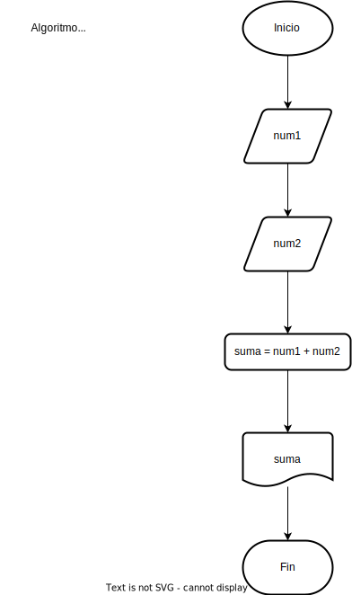

# Capítulo 1

## Ejemplo de un diagrama de flujo


## Ejercicios

1. Ejercicios con operaciones matemáticas simples y manejo de caracteres:

    a. Escribe un algoritmo que tome dos números como entrada y devuelva la suma de los dos números.

    b. Escribe un algoritmo que tome el nombre de una persona y muestre un mensaje de bienvenida. Ej: para la variable nombre = "Alex" el mensaje será "Bienvenido Alex".

    c. Escribe un algoritmo que tome la edad de 4 estudiantes y calcule el promedio de la edad de los 4 y muestre el mensaje un mensaje con texto describiendo el resultado. Ej: para las edades 3, 4, 4, 5 el mensaje será "La edad promedio de los estudiantes es 4"

2. Ejercicios con condicionales:

    a. Escribe un algoritmo que tome tres números como entrada y determine cuál es el número mayor.

    b. Escribe un algoritmo que dados 3 colores amarillo, azul y rojo, muestre la combinación de 2 en 2. Ej: "amarillo y azul es verde", "amarillo y rojo es naranja",...

    c. Escribe un algoritmo que tome 4 números como entrada y determine cuál es el número mayor.

3. Ejercicio de conteo regresivo:
   Escribe un algoritmo que tome un número como entrada y muestre todos los números en orden descendente hasta llegar a cero.

4. Ejercicio de factorial:
   Escribe un algoritmo que tome un número como entrada y calcule su factorial. El factorial de un número se calcula multiplicando ese número por todos los enteros positivos menores que él.

5. Ejercicio de determinar si un número es primo:
   Escribe un algoritmo que tome un número como entrada y determine si es primo o no. Un número primo es aquel que solo es divisible por 1 y por sí mismo.

6. Ejercicio de encontrar el número máximo en una lista:
   Escribe un algoritmo que tome una lista de números como entrada y determine el número máximo en esa lista.

7. Ejercicio de ordenar una lista de números:
   Escribe un algoritmo que tome una lista de números como entrada y la ordene en orden ascendente.

8. Ejercicio de búsqueda en una lista:
   Escribe un algoritmo que tome una lista de números y un número objetivo como entrada, y determine si el número objetivo está presente en la lista.

9. Ejercicio de contar elementos en una lista:
   Escribe un algoritmo que tome una lista de números como entrada y cuente cuántos elementos hay en la lista.

10. Ejercicio de encontrar números pares e impares en una lista:
    Escribe un algoritmo que tome una lista de números como entrada y separe los números pares de los impares en dos listas diferentes.

## Solución Ejercicio 1

### Paso a paso - Suma de dos números

1. Inicio
2. Leer el primer número (num1)
3. Leer el segundo número (num2)
4. Sumar num1 y num2, y guardar el resultado en una variable llamada suma
5. Mostrar el valor de suma
6. Fin

## El diagrama de flujo



## El script

```javascript
// Suma de dos números

// Paso 2: Leer el primer número (num1)
const num1 = parseInt(prompt("Ingresa el primer número:"));

// Paso 3: Leer el segundo número (num2)
const num2 = parseInt(prompt("Ingresa el segundo número:"));

// Paso 4: Sumar num1 y num2, y guardar el resultado en una variable llamada suma
const suma = num1 + num2;

// Paso 5: Mostrar el valor de suma
console.log("La suma de los dos números es: " + suma);

// Fin
```

## Nota aclaratoria

Es probable que no entiendas aún cómo solucionar varios de estos ejercicios. **No te preocupes**. Inicialmente, iremos navegando por una serie de ejemplos y ejercicios que te darán las bases escenciales para resolver cualquiera da estos e incluso muchos otros más.
