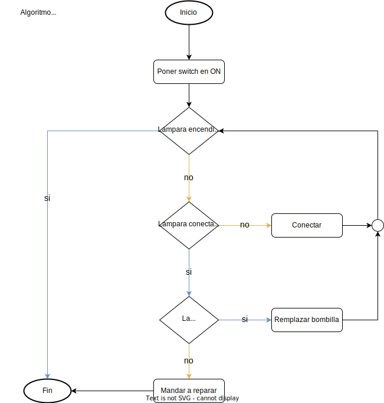

# Capítulo 1

## Ejemplo de un diagrama de flujo



## Ejercicios

1. Ejercicio de suma de dos números:
   Escribe un algoritmo que tome dos números como entrada y devuelva la suma de los dos números.

2. Ejercicio de encontrar el número mayor:
   Escribe un algoritmo que tome tres números como entrada y determine cuál es el número mayor.

3. Ejercicio de conteo regresivo:
   Escribe un algoritmo que tome un número como entrada y muestre todos los números en orden descendente hasta llegar a cero.

4. Ejercicio de factorial:
   Escribe un algoritmo que tome un número como entrada y calcule su factorial. El factorial de un número se calcula multiplicando ese número por todos los enteros positivos menores que él.

5. Ejercicio de determinar si un número es primo:
   Escribe un algoritmo que tome un número como entrada y determine si es primo o no. Un número primo es aquel que solo es divisible por 1 y por sí mismo.

6. Ejercicio de encontrar el número máximo en una lista:
   Escribe un algoritmo que tome una lista de números como entrada y determine el número máximo en esa lista.

7. Ejercicio de ordenar una lista de números:
   Escribe un algoritmo que tome una lista de números como entrada y la ordene en orden ascendente.

8. Ejercicio de búsqueda en una lista:
   Escribe un algoritmo que tome una lista de números y un número objetivo como entrada, y determine si el número objetivo está presente en la lista.

9. Ejercicio de contar elementos en una lista:
   Escribe un algoritmo que tome una lista de números como entrada y cuente cuántos elementos hay en la lista.

10. Ejercicio de encontrar números pares e impares en una lista:
    Escribe un algoritmo que tome una lista de números como entrada y separe los números pares de los impares en dos listas diferentes.

## Solución Ejercicio 1

### Paso a paso - Suma de dos números

1. Inicio
2. Leer el primer número (num1)
3. Leer el segundo número (num2)
4. Sumar num1 y num2, y guardar el resultado en una variable llamada suma
5. Mostrar el valor de suma
6. Fin

## El diagrama de flujo


## El script

```javascript
const num1 = 10;
const num2 = 15;

const suma = num1 + num2;

console.log(suma);
```
